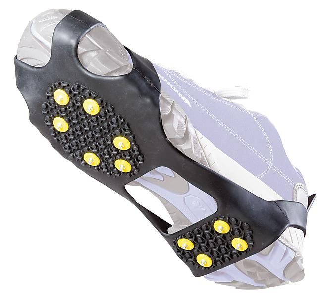

# 👟 AmniStep – Semelle Connectée pour Seniors

**AmniStep** est une semelle intelligente conçue pour détecter les chutes chez les personnes âgées et alerter automatiquement leurs proches ou les secours en temps réel. Discrète, confortable et dotée d’une grande autonomie, elle s’intègre parfaitement dans les chaussons ou chaussures habituelles.

---

## 🎯 Objectif

Réduire les conséquences graves des chutes chez les seniors en proposant une solution **non intrusive**, **intelligente** et **connectée**, grâce à l'IoT et à l'intelligence artificielle embarquée.

---

## 🚀 Fonctionnalités Clés

- 📉 **Détection automatique des chutes** (algorithme embarqué)  
- 📲 **Alerte en temps réel** par SMS, appel ou notification à un proche  
- 🔋 **Autonomie longue durée** (plusieurs semaines à plusieurs mois)  
- 🧠 **Analyse des mouvements** pour différencier une chute d’un simple faux pas  
- 💡 **Design discret** : se glisse dans n'importe quelle chaussure  

---

## ⚙️ Technologies utilisées

- **IoT (ESP32 ou similaire)**  
- **Capteurs IMU (accéléromètre, gyroscope)**  
- **Bluetooth Low Energy (BLE)**  
- **Machine Learning embarqué**  
- **Plateforme mobile (Android/iOS - en développement)**  

---

## 🧓 Pourquoi AmniStep ?

- 1 senior sur 3 chute chaque année  
- Les dispositifs portés (bracelet, collier) sont souvent oubliés ou rejetés  
- AmniStep est **invisible** et **toujours en place**  
➡️ Une innovation au service de la **Silver Économie**

---

## 🌍 Impact sociétal

AmniStep contribue à :  
- 🏡 L’autonomie prolongée à domicile  
- ❤️ La tranquillité d’esprit des familles  
- 💰 La réduction des coûts médicaux liés aux chutes  

---

🛠️ État du projet
🔄 Prototype électronique en cours de développement

🔄 Phase de test avec utilisateurs réels en cours

📝 Candidature au label Startup Act en Tunisie

📦 Préparation d'une première version bêta

---

## 📸 Aperçu

---

## 🤝 Contributeurs

- **Khouloud Othmani** – Fondatrice, ingénieure hardware  
- (ajoute d'autres membres si applicable)  

---

## 📬 Contact

Pour en savoir plus, contactez-nous  

📧 harbiyoussef8@gmail.com  
📧 othmanikhouloud0@gmail.com  
🌐 [Site Web à venir]  

---

## 📄 Licence

Ce projet est sous licence libre pour usage commercial. Contactez-nous pour plus de détails.

---

*AmniStep – Une innovation au service du bien-vieillir.*
